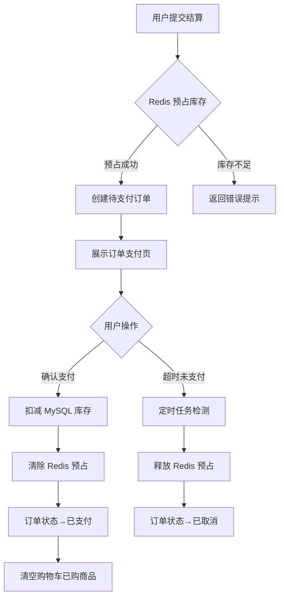

## 1. 产品概述

在现有电商管理系统中实现「库存预占与扣减」机制，解决高并发下单场景下的超卖问题。用户提交购物结算时，系统先在 Redis 中预占库存并生成待支付订单；支付确认后正式扣减 MySQL 库存并清除预占；超时未支付则自动释放预占库存。同时提供用户查看自己订单列表和管理员查看全部订单的管理页面。

- 目标用户：普通用户（下单购买）、管理员（订单管理、库存监控）
- 核心价值：保证库存一致性，防止超卖，提供完整的订单生命周期管理

## 2. 核心功能

### 2.1 用户角色

| 角色 | 注册方式 | 核心权限 |
|------|----------|----------|
| USER | 系统已有注册 | 浏览商品、管理购物车、下单结算、查看自己的订单 |
| ADMIN | 系统已有 | 查看全部订单、管理商品库存、订单管理 |

### 2.2 功能模块

1. **提交订单（库存预占）**：用户在结算页提交订单，系统在 Redis 中预占库存，生成待支付订单
2. **模拟支付确认**：用户点击支付按钮确认支付，扣减 MySQL 库存，清除 Redis 预占
3. **超时自动释放**：订单创建后 30 分钟未支付，系统自动释放 Redis 预占库存，订单变为已取消
4. **用户订单列表**：用户查看自己的所有订单及其状态
5. **管理员订单管理**：管理员查看全部订单，支持筛选与搜索

### 2.3 页面详情

| 页面名称 | 模块名称 | 功能描述 |
|----------|----------|----------|
| 订单结算页 | 提交订单表单 | 展示购物车商品清单、总金额，点击提交触发库存预占并创建待支付订单 |
| 订单支付页 | 支付确认 | 展示待支付订单详情，点击确认支付完成扣减，显示倒计时超时提示 |
| 我的订单页 | 用户订单列表 | 用户查看自己的全部订单，支持按状态筛选，展示订单号/金额/状态/时间 |
| 订单详情页 | 订单详细信息 | 展示订单完整信息，包含商品明细、支付状态、时间线 |
| 全部订单管理页 | 管理员订单列表 | 管理员查看全部订单，支持搜索/筛选/分页，查看订单详情 |

## 3. 核心流程

用户从购物车进入结算页 → 点击提交订单 → 系统在 Redis 中原子预占库存（DECRBY）→ 预占成功后创建待支付订单写入 MySQL → 返回订单支付页 → 用户确认支付 → 扣减 MySQL 库存 + 清除 Redis 预占 + 订单状态变更为已支付 → 清空购物车中已购买商品。若 30 分钟未支付 → 定时任务检测超时订单 → 释放 Redis 预占库存（INCRBY）→ 订单状态变更为已取消。

## 4. 用户界面设计

### 4.1 设计风格

- 主色调：延续现有系统 `--brand0: #2563eb`（蓝）、`--brand1: #7c3aed`（紫）
- 按钮风格：延续现有 `.btn .primary` 圆角实心按钮
- 字体：延续系统默认字体栈
- 布局：卡片式布局，与现有页面保持一致
- 图标：使用 emoji 作为状态图标（延续现有风格）

### 4.2 页面设计概览

| 页面名称 | 模块名称 | UI 元素 |
|----------|----------|---------|
| 订单支付页 | 倒计时提示 | 顶部醒目倒计时条，显示剩余支付时间 |
| 订单支付页 | 订单摘要 | 卡片展示订单号、商品列表、总金额 |
| 订单支付页 | 支付按钮 | 醒目的确认支付按钮，超时后变为已取消提示 |
| 我的订单页 | 订单列表 | 卡片列表，每个订单显示订单号/状态徽章/金额/时间 |
| 我的订单页 | 状态筛选 | 标签切换：全部/待支付/已支付/已取消 |
| 管理员订单页 | 搜索筛选 | 搜索框+状态下拉+分页表格 |
| 管理员订单页 | 订单表格 | 表格展示全部订单，支持按用户/状态筛选 |

### 4.3 响应式

- 桌面优先设计，移动端自适应
- 订单列表在移动端切换为卡片布局
- 触控优化：按钮最小 44px 点击区域
