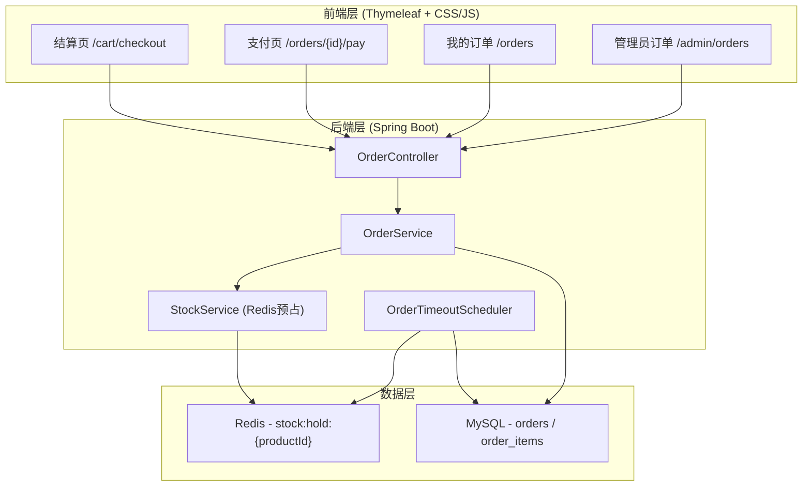
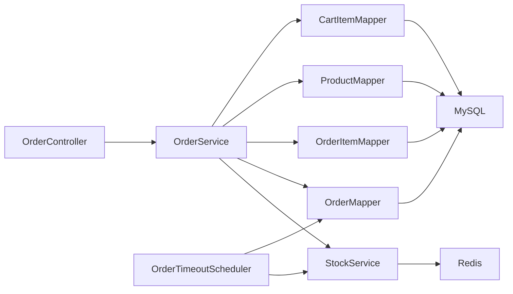
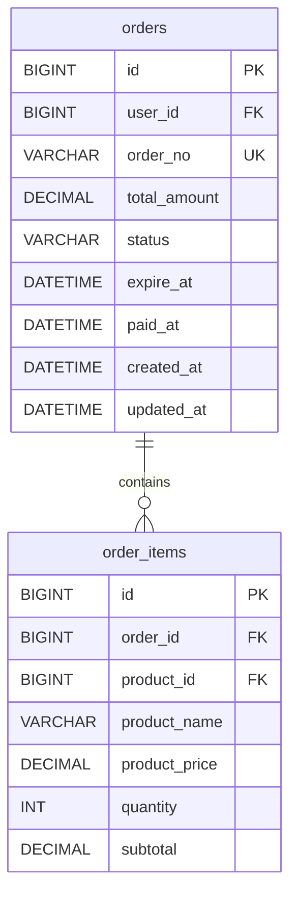

## 1. 架构设计



## 2. 技术说明

- 前端：Thymeleaf 模板引擎 + 原生 CSS/JS（延续现有项目风格）
- 后端：Spring Boot 3.3.8 + MyBatis Plus 3.5.7
- 数据库：MySQL 8（订单表）+ Redis（库存预占）
- 缓存：Spring Cache + Redis（延续现有配置）
- 安全：Spring Security（延续现有认证授权）
- 定时任务：Spring @Scheduled（订单超时检测）

## 3. 路由定义

| 路由 | 用途 |
|------|------|
| POST /orders | 提交订单（库存预占 + 创建订单） |
| GET /orders/{id}/pay | 订单支付页面 |
| POST /orders/{id}/pay | 确认支付（扣减库存 + 清除预占） |
| POST /orders/{id}/cancel | 用户主动取消订单（释放预占） |
| GET /orders | 用户订单列表 |
| GET /orders/{id} | 订单详情页 |
| GET /admin/orders | 管理员订单列表 |

## 4. API 定义

### 4.1 提交订单

```
POST /orders
请求：无显式参数（从当前用户购物车读取）
响应：302 重定向到 /orders/{id}/pay
```

### 4.2 确认支付

```
POST /orders/{id}/pay
请求：无
响应：302 重定向到 /orders/{id}?paid
```

### 4.3 取消订单

```
POST /orders/{id}/cancel
请求：无
响应：302 重定向到 /orders
```

## 5. 服务架构图



## 6. 数据模型

### 6.1 数据模型定义



### 6.2 数据定义语言

```sql
CREATE TABLE IF NOT EXISTS orders (
  id BIGINT PRIMARY KEY AUTO_INCREMENT,
  user_id BIGINT NOT NULL,
  order_no VARCHAR(32) NOT NULL UNIQUE,
  total_amount DECIMAL(10,2) NOT NULL DEFAULT 0.00,
  status VARCHAR(20) NOT NULL DEFAULT 'PENDING_PAYMENT',
  expire_at DATETIME DEFAULT NULL,
  paid_at DATETIME DEFAULT NULL,
  created_at DATETIME NOT NULL DEFAULT CURRENT_TIMESTAMP,
  updated_at DATETIME NOT NULL DEFAULT CURRENT_TIMESTAMP ON UPDATE CURRENT_TIMESTAMP,
  INDEX idx_orders_user_id (user_id),
  INDEX idx_orders_status (status),
  INDEX idx_orders_expire_at (expire_at),
  CONSTRAINT fk_orders_user FOREIGN KEY (user_id) REFERENCES users(id) ON DELETE RESTRICT
) ENGINE=InnoDB DEFAULT CHARSET=utf8mb4;

CREATE TABLE IF NOT EXISTS order_items (
  id BIGINT PRIMARY KEY AUTO_INCREMENT,
  order_id BIGINT NOT NULL,
  product_id BIGINT NOT NULL,
  product_name VARCHAR(50) NOT NULL,
  product_price DECIMAL(10,2) NOT NULL,
  quantity INT NOT NULL,
  subtotal DECIMAL(10,2) NOT NULL,
  CONSTRAINT fk_order_items_order FOREIGN KEY (order_id) REFERENCES orders(id) ON DELETE CASCADE,
  CONSTRAINT fk_order_items_product FOREIGN KEY (product_id) REFERENCES products(id) ON DELETE RESTRICT
) ENGINE=InnoDB DEFAULT CHARSET=utf8mb4;
```

### 6.3 Redis 数据结构

- **库存预占键**：`stock:hold:{productId}` → Value 为已预占数量（整数）
- **预占明细键**：`stock:hold:order:{orderId}:{productId}` → Value 为该订单对某商品的预占数量，TTL = 30分钟
- 可用库存计算：`可用库存 = MySQL stock - Redis stock:hold:{productId}`

## 7. 并发安全策略

### 7.1 库存预占（Redis 原子操作）

使用 Redis `DECRBY` 原子操作实现库存预占：
1. 读取 `stock:hold:{productId}` 获取已预占数量
2. 计算 `可用库存 = MySQL.stock - 已预占数量`
3. 若可用库存 < 请求数量，返回库存不足
4. 使用 Redis Lua 脚本保证「检查+预占」原子性：
   - 检查预占后总量不超过 MySQL 库存
   - 原子递增预占计数

### 7.2 超时释放

- Spring `@Scheduled(fixedRate = 60000)` 每分钟扫描超时订单
- 查询 `status = PENDING_PAYMENT AND expire_at < NOW()`
- 释放 Redis 预占 + 更新订单状态为 CANCELLED

### 7.3 支付扣减

- 支付时使用 `SELECT ... FOR UPDATE` 行锁扣减 MySQL 库存
- 确保扣减后库存不为负
- 扣减成功后清除 Redis 预占计数
